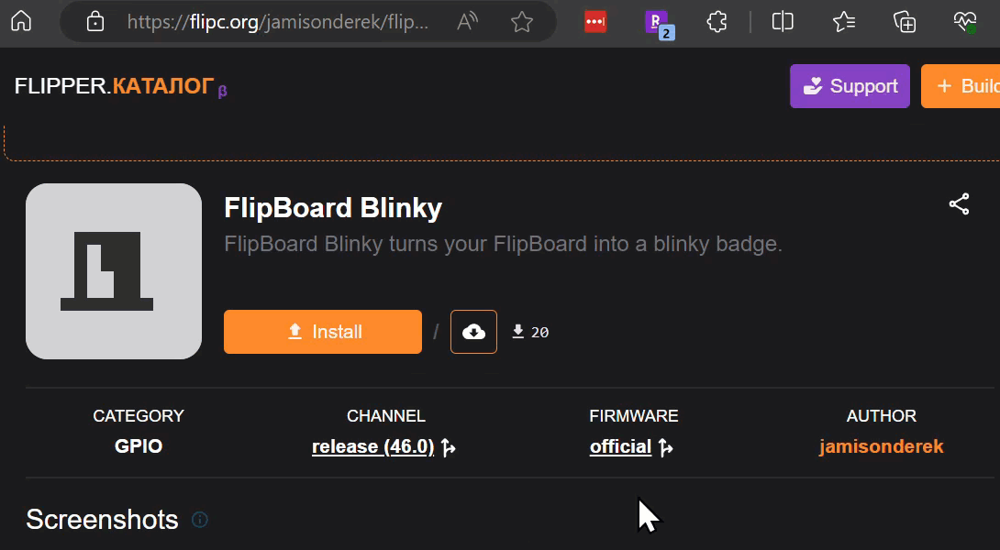
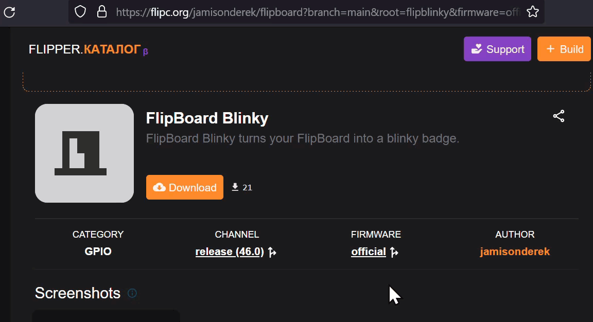
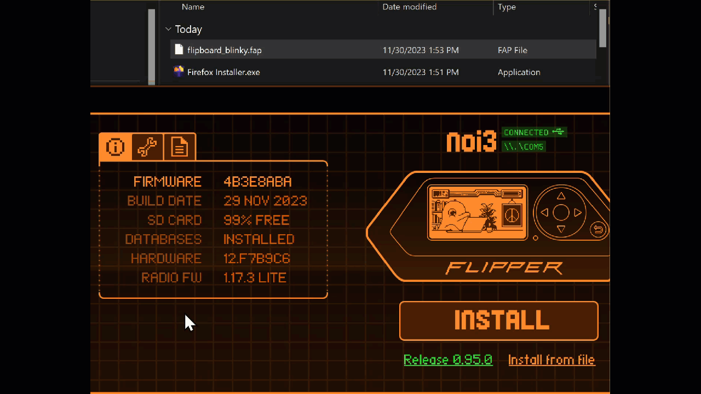
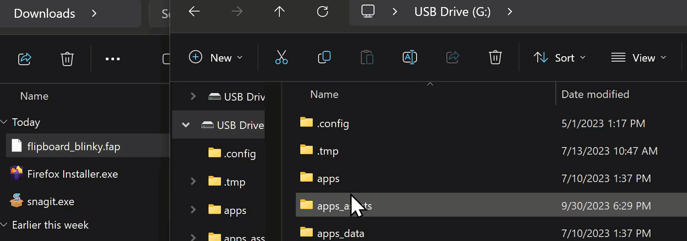

# Flipboard

- [Overview](#overview)
- [Applications](#applications)
  - [FlipKeyboard](./flipkeyboard/README.md)
  - [FlipBlinky](./flipblinky/README.md)
  - [FlipSignal](./flipsignal/README.md)
  - [Simon Tutorial](./simon-tutorial/README.md)
- [Installing Apps](#installing-apps)
  - [Using flipc.org (Chrome, Edge, Opera)](#using-flipcorg-chrome-edge-opera)
  - [Using flipc.org (Other browsers)](#using-flipcorg-other-browsers)
  - [Copying FAP using qFlipper](#copying-fap-using-qflipper)
  - [Copying FAP using SD Card](#copying-fap-using-sd-card)
  - [Building with VSCode (Visual Studio Code)](#building-with-vscode-visual-studio-code)
  - [Building with FBT](#building-with-fbt)
  - [Building with UFBT](#building-with-ufbt)
- [Running the application](#running-the-application)
- [Support](#support)

## Overview

The FlipBoard v1.1 is a versatile device for the Flipper Zero that can enable all kinds of features. It has 4 buttons that connect via separate GPIO pins, so you can react to any combinations of button up/down events. Each button has a 24-bit color LED that is programmable using the WS2812b protocol. There is also a small single-color LED on the board you can use, for example, to signal a status change.

Currently there are three applications written for the FlipBoard that demonstrate many of the key features.  FlipKeyboard is a macropad application that can automate repetative tasks, typing many keys in a single button click.  FlipBlinky is visual effects, useful if you are wearing your Flipper Zero with FlipBoard as a badge at a conference.  FlipSignal sends Sub-GHz and IR signals.  We will be adding more applications as time progresses, along with tutorials on how to write your own applications! Please let us know your feedback.

You can order your FlipBoard from [https://tindie.com/stores/MakeItHackin](https://tindie.com/stores/MakeItHackin).

## Applications

- [FlipKeyboard](./flipkeyboard/README.md)
- [FlipBlinky](./flipblinky/README.md)
- [FlipSignal](./flipsignal/README.md)
- [Simon Tutorial](./simon-tutorial/README.md)

## Installing Apps

There are multiple ways to install applications on your Flipper Zero.  If you just want to run the apps without making any customizations, you can install a FAP (Flipper Application Package) file that is built for you.  If you want to customize the app & follow along with the various tutorials, it is recommended you install the source code and build it yourself!

If you just want to run applications without customizing, here are some options:
- GOOD OPTION: [Install using flipc.org (requires Chrome, Edge or Opera web browser)](#using-flipcorg-chrome-edge-opera)
- [Download FAP from flipc.org (Other browsers)](#using-flipcorg-other-browsers)
  - [Install FAP on Flipper using qFlipper](#copying-fap-using-qflipper)
  - [Install FAP on Flipper using SD Card](#copying-fap-using-sd-card)

If you want to modify the code, here are some options:
- BEST OPTION: [Build FAP with VSCode (Visual Studio Code)](#building-with-vscode-visual-studio-code)
- [Build FAP with FBT tool](#building-with-fbt)
- [Build FAP with UFBT tool](#building-with-ufbt)

### Using flipc.org (Chrome, Edge, Opera)

For best experience, use the latest version of Chrome, Microsoft Edge or Opera.  Other browsers will only give you a file you need to manually install (since they don't support the [Web Serial API](https://caniuse.com/web-serial)).

Flipc.org is a website that allows you to install FAP files directly from the web.  This is an unofficial website and is not affiliated with the Flipper Zero team, run by a single person.  It is provided as a convenience for users who want to install apps without having to build them from source.

- Step 1: **Load the web page** for the app you want to install.  Other people may have "forked" the app and made their own version, so make sure you are using the correct link.  In some cases, their changes may improve the product, but in other cases, they may have introduced bugs or malicious code.  **Use at your own risk.**
  - https://flipc.org/jamisonderek/flipboard?branch=main&root=flipblinky
  - https://flipc.org/jamisonderek/flipboard?branch=main&root=flipsignal
  - https://flipc.org/jamisonderek/flipboard?branch=main&root=flipkeyboard

- Step 2: Click on the underlined text under FIRMWARE and **choose the firmware** that matches what you are running on your Flipper Zero. (Official, Unleashed, RogueMaster, Xtreme)
- Step 3: Click on the underlined text under CHANNEL and **choose the current channel** you are running on your Flipper Zero.  (Release, Release Candidate, Development)
- Step 4: **Connect your Flipper Zero** to your computer. Make sure nothing is running on your computer that is using the serial port.  In particular, close qFlipper, close https://lab.flipper.net, and close any CLI tools that communicate with the Flipper Zero.
- Step 5: Click on the orange **Install button**.
  - The application should get installed.
  - The Install button should change to an orange Run of Flipper button.
  - You can try "Run on Flipper" to run the application, but this will not work for all firmware versions.

### Using flipc.org (Other browsers)

For best experience, use the latest version of Chrome, Microsoft Edge or Opera.  Other browsers will only give you a file you need to manually install (since they don't support the [Web Serial API](https://caniuse.com/web-serial)).

Flipc.org is a website that allows you to install FAP files directly from the web.  This is an unofficial website and is not affiliated with the Flipper Zero team, run by a single person.  It is provided as a convenience for users who want to install apps without having to build them from source.

- Step 1: **Load the web page** for the app you want to install.  Other people may have "forked" the app and made their own version, so make sure you are using the correct link.  In some cases, their changes may improve the product, but in other cases, they may have introduced bugs or malicious code.  **Use at your own risk.**
  - https://flipc.org/jamisonderek/flipboard?branch=main&root=flipblinky
  - https://flipc.org/jamisonderek/flipboard?branch=main&root=flipsignal
  - https://flipc.org/jamisonderek/flipboard?branch=main&root=flipkeyboard
- Step 2: Click on the underlined text under FIRMWARE and **choose the firmware** that matches what you are running on your Flipper Zero. (Official, Unleashed, RogueMaster, Xtreme)
- Step 3: Click on the underlined text under CHANNEL and **choose the current channel** you are running on your Flipper Zero.  (Release, Release Candidate, Development)
- Step 4: **Connect your Flipper Zero** to your computer. Make sure nothing is running on your computer that is using the serial port.  In particular, close qFlipper, close https://lab.flipper.net, and close any CLI tools that communicate with the Flipper Zero.
- Step 5: Click on the orange **Download button**. The browser should automatically download the file and put it in your web download folder.
- Step 6: **Install the FAP** onto your Flipper Zero using one of the methods below.
  - [Using qFlipper](#copying-fap-using-qflipper)
  - [Using SD Card](#copying-fap-using-sd-card)

### Copying FAP using qFlipper

If you are using a browser that does not support the Web Serial API, you will need to manually copy the FAP file to your Flipper Zero.

- Step 1: Download the FAP file to your computer.
- Step 2: Connect your Flipper Zero to your computer.
- Step 3: Launch [qFlipper](https://docs.flipper.net/qflipper) application.
- Step 4: Click the `Files` tab in qFlipper.
- Step 5: Navigate to `SD Card/apps/GPIO` folder (or whatever category your FAP is).
- Step 6: Drag the FAP file from your computer to the qFlipper window.

### Copying FAP using SD Card

If you are using a browser that does not support the Web Serial API, you will need to manually copy the FAP file to your Flipper Zero.

- Step 1: Download the FAP file to your computer.
- Step 2: Navigate to `Settings`/`Storage`/`Unmount SD Card`/`Unmount`.
- Step 3: Eject the SD Card from your Flipper Zero & insert it into your computer.

- Step 4: Drag the file into `/apps/GPIO` folder (or whatever category your FAP is).
- Step 5: Eject the SD Card from your computer & insert it back into your Flipper Zero.

### Building with VSCode (Visual Studio Code) 

This is the recommended configuration if you are going to be editing the existing applications or writing your own.  You will get code completion and be able to step into the firmware code, finding out how a specific function works.

Prerequisites:
- [Install Python](https://www.python.org/downloads/)
- [Install GIT tools](https://git-scm.com/downloads)
- [Install VSCode](https://code.visualstudio.com/download)

Configure VSCode:
- Step 1: Make sure you have installed the above prerequisites.
- Step 2: Create a folder called `repos` in your home directory.  You can use any folder you want, but this tutorial assumes you are using `/repos` folder.  
- Step 3: Open VSCode.
- Step 4: Clone the Flipboard repository.
  - Step 4a: `View`/`Command Palette`/`Git: Clone`
  - Step 4b: Enter the URL of the flipboard repository `https://github.com/jamisonderek/flipboard.git` then click **Clone from URL** and choose your `/repos` folder as the target.  This will create a folder called `flipboard` in your `repos` folder.
  - Step 4c: When prompted if you would like to open the repository, choose `Open`.
  - Step 4d: When prompted if you trust the authors, choose `Yes` (or choose `No` if you prefer.)
- Step 5: **Recursively clone** the firmware repository. 
  - Step 5a: `View`/`Command Palette`/`Git: Clone (Recursive)`
  - Step 5b: Enter the URL of the firmware you would like to run on your Flipper and choose your `/repos` folder as the target.
    - Official: `https://github.com/flipperdevices/flipperzero-firmware.git`
    - Unleashed: `https://github.com/DarkFlippers/unleashed-firmware.git`
    - RogueMaster: `https://github.com/RogueMaster/flipperzero-firmware-wPlugins.git`
    - Xtreme: `https://github.com/Flipper-XFW/Xtreme-Firmware.git`
  - Step 5c: When prompted if you would like to open the repository, choose `Open`.
  - Step 5d: When prompted if you trust the authors, choose `Yes` (so you will be able to build the code later.)
- Step 6: Install VSCode tools
  - Step 6a: Right click on `fbt` and choose `Open in Integrated Terminal`.
  - Step 6b: Type `./fbt vscode_dist` and press enter.
  - Step 6c: When prompted if you would like to install the recommended extensions, choose `Install`.
  - Step 6d: Be sure the extensions `CMAKE` and `CMAKE TOOLS` are disabled for the workspace, otherwise Ctrl+Shift+B may not show the build options!
- Step 7: Build and deploy
  - Step 7a: Connect your Flipper to the computer.
  - Step 7b: Press `Ctrl+Shift+B` to bring up the build options.
  - Step 7c: Choose `[Debug] Flash (USB, with resources)`.
  - Step 7d: The firmware and FAPs should get built.
  - Step 7e: The firmware should get installed on the Flipper Zero.
- Step 8: Copy the applications from the flipboard repository to the firmware repository's `application_user` folder.
  - Step 8a: Copy the folder `flipblinky` from `/repos/flipboard/flipblinky` to `./applications_user/flipblinky`.
  - Step 8b: Copy the folder `flipsignal` from `/repos/flipboard/flipsignal` to `./applications_user/flipsignal`.
  - Step 8c: Copy the folder `flipkeyboard` from `/repos/flipboard/flipkeyboard` to `./applications_user/flipkeyboard`.

Build and deploy the application:
  - Step 1: Connect your Flipper to the computer.
  - Step 2: Open the file `./applications_user/flipblinky/app.c` (or whichever application you want to build)
  - Step 3: Press `Ctrl+Shift+B` to bring up the build options.
  - Step 4: Choose `[Debug] Launch App on Flipper`.
  - Step 5: The application should get built, the FAP installed on the Flipper Zero, and then the application should get launched.

### Building with FBT

If you prefer a different editor, then using FBT may be a good option.  FBT is a command line tool that can build the firmware and applications.  This is the same tool used by VSCode.

Prerequisites:
- [Install Python](https://www.python.org/downloads/)
- [Install GIT tools](https://git-scm.com/downloads)

Configure FBT:
- Step 1: Make sure you have installed the above prerequisites.
- Step 2: Create a folder called `repos` in your home directory.  You can use any folder you want, but this tutorial assumes you are using `/repos` folder.
- Step 3: Clone the Flipboard repository.
  - Step 3a: Open a command prompt.
  - Step 3b: Change directory to your `/repos` folder (`cd /repros`).
  - Step 3c: Clone the flipboard repository `git clone https://github.com/jamisonderek/flipboard.git`
- Step 4: Clone the firmware repository recursively.
  - Step 4a: Open a command prompt.
  - Step 4b: Change directory to your `/repos` folder.
  - Step 4c: Clone the firmware repository you would like to run on your Flipper.
    - Official: `git clone --recursive https://github.com/flipperdevices/flipperzero-firmware.git`
    - Unleashed: `git clone --recursive https://github.com/DarkFlippers/unleashed-firmware.git`
    - RogueMaster: `git clone --recursive https://github.com/RogueMaster/flipperzero-firmware-wPlugins.git roguemaster-firmware`
    - Xtreme: `git clone --recursive https://github.com/Flipper-XFW/Xtreme-Firmware.git`
- Step 5: Deploy the firmware
  - Step 5a: Connect your Flipper to the computer.
  - Step 5b: Open a command prompt.
  - Step 5c: Change directory to the firmware repository you cloned.
  - Step 5d: Run the command `./fbt FORCE=1 flash_usb_full`
- Step 6: Copy the applications from the flipboard repository to the firmware repository's `application_user` folder.
  - Step 6a: Copy the folder `flipblinky` from `/repos/flipboard/flipblinky` to `./applications_user/flipblinky`.
  - Step 6b: Copy the folder `flipsignal` from `/repos/flipboard/flipsignal` to `./applications_user/flipsignal`.
  - Step 6c: Copy the folder `flipkeyboard` from `/repos/flipboard/flipkeyboard` to `./applications_user/flipkeyboard`.

Build and deploy the application:
  - Step 1: Connect your Flipper to the computer.
  - Step 2: Open a command prompt.
  - Step 3: Change directory to the firmware repository you cloned.
  - Step 4: Run the command `./fbt launch APPSRC=./applications_user/flipblinky/app.c` (or whichever application you want to build)

### Building with UFBT

Prerequisites:
- [Install Python](https://www.python.org/downloads/)
- [Install GIT tools](https://git-scm.com/downloads)

Prepare environment:
- Step 1: Make sure you have installed the above prerequisites.
- Step 2: Create a folder called `repos` in your home directory.  You can use any folder you want, but this tutorial assumes you are using `/repos` folder.
- Step 3: Clone the Flipboard repository.
  - Step 3a: Open a command prompt.
  - Step 3b: Change directory to your `/repos` folder (`cd /repros`).
  - Step 3c: Clone the flipboard repository `git clone https://github.com/jamisonderek/flipboard.git`
- Step 4: Install ubft tool.
  - Linux & macOS: `python3 -m pip install --upgrade ufbt`
  - Windows: `py -m pip install --upgrade ufbt`
- Step 5: Build and deploy the application.
  - Step 5a: Connect your Flipper to the computer.
  - Step 5b: Open a command prompt.
  - Step 5c: Change directory to the flipboard application. (`cd /repos/flipboard/flipblinky`)
  - Step 5d: Run the command `ufbt launch`.

## Running the application

- Step 1: Make sure you have followed the step to [install the application](#installing-apps).
- Step 2: On the Flipper Zero, navigate to the `Apps` menu.
- Step 3: Select the type of application (like GPIO) you want to run.
- Step 4: Select the application you want to run.

## Support

If you have any questions, please contact us on Discord at https://discord.com/invite/NsjCvqwPAd