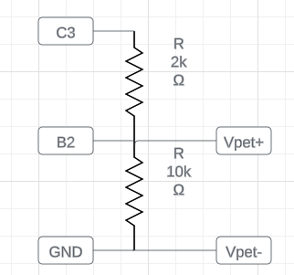

# Flipper Zero F-Com

## Overview

A Flipper Zero app that allows the flipper to communicate with Digimon V-Pets.

Currently tested:
Classic:
- 1997 Digital Monster
- 1998 Digimon Pendulum
- 1999 Digivice
- 2000 D-3
- 2000 D-Terminal
- 2002 D-Scanner
- 2002 Digimon Pendulum Progress
- 2003 Digimon Pendulum X
- 2005 Digimon Accel
- 2005 Digimon Mini
- 2006 Digivice iC

Modern:
- 2017 Digital Monster Ver.20th
- 2018 Digimon Pendulum Ver.20th
- 2019 Digital Monster X
- 2020 Digimon Pendulum Z
- 2021 Digivice Ver.Complete

Color:
- 2023 Digital Monster COLOR

Untested:
- All other pets
- Listen Mode

Thanks to [Joushiikuta](https://www.youtube.com/@joushiikuta) for testing the classic devices which I do not have.

Based on:
- The DMComm project by BladeSabre: https://github.com/dmcomm/dmcomm-project
- The updated DMComm Arduino library by BladeSabre: https://github.com/dmcomm/dmcomm-arduino-lib
- The Flipper Zero Boilerplate App: https://github.com/leedave/flipper-zero-fap-boilerplate
- The Flipper Zero Firmware: https://github.com/flipperdevices/flipperzero-firmware

### Youtube Example

## Flipper Hat Module

You will need to construct a circuit similar to the A-Com circuit described in teh dmcomm-project github.

Pin C3 - 4k resistor - Pin B2 - 20k resistor - Pin GND

Pin B2 - VPet+

Pin GND - VPet-

The 4k/20k resistor pairing is confirmed to work with the older devices. If you only need modern device support 2k/10k is also compatible, though it will not work with older devices.

[Joushiikuta](https://www.youtube.com/@joushiikuta) has created an awesome gerber file for a compatible PCB located [here](pcb/20240225_FlipperZero_F-Com_PCB_Thickness_1.6mm_Gerber.zip) (included with permission)

You will also need compatible right angle header pins and SMD resistors.

## Installation

The F-Com app is compiled and installed with [ufbt](https://github.com/flipperdevices/flipperzero-ufbt)

After installing ufbt, checkout the F-Com git repository, connect your flipper, and run "ufbt launch" to install.

It will be installed under the GPIO section.

This repository contains a selection of digiroms in the codes directory. You may copy them to the app_data/fcom directory on your
flipper to make them accessible under the "Saved" menu option.

## Menu options

### Listen

Listen is currently untested, as I have not created a jig to make it function!!

Listen allows you to connect 2 vpets to each other and eavesdrop on the data they send. Both codes will show up on the flipper after communication completes, and you can save either code to the flipper for later use. Leaving this screen will pause dmcomm.

### Saved

Saved will open a file picker, allowing you to choose a previously saved digirom code. After selection, the flipper will begin attempting to repeatedly send the code. After the code is sent, the received response will display on the screen, and you can optionally save the response to another file on the flipper. Leaving this screen will pause dmcomm.

### Add Manually

Add manually will open a dialog allowing you to enter a digimon manually on the flipper itself. The flipper keyboard does not currently support special characters so ^ and @ characters cannot yet be entered. After entering the code a second text entry screen will display allowing you to enter a file name. After saving, it will return to the main menu. If you wish to send the code you can enter 'Saved' and select it.

### USB A-Com

Tested with the Alpha-Wiki Android App.

The flipper will change the USB port from CLI mode into Serial mode and behave as an A-Com. Serial data transferred in both directions will appear in the flipper's text box on screen. Pressing the back button will return the USB port to CLI mode and pause dmcomm.

## Other Notes / Future stuff

Dmcomm supports a voltage test. However, the flipper zero firmware does not yet have ADC support implemented. This is still possible as demonstrated by the flipper zero oscilloscope project. At some point I may implement this. A-Com's themselves use analog input in order to support a wider range of devices logic levels. This may limit the flipper app's compatibility for now.

DMC support isn't included in the dmcomm-project ino, but has been added to the updated https://github.com/dmcomm/dmcomm-arduino-lib project. At some point I may update this to port the CPP code onto the flipper.

Debug mode support could be added at some point.
