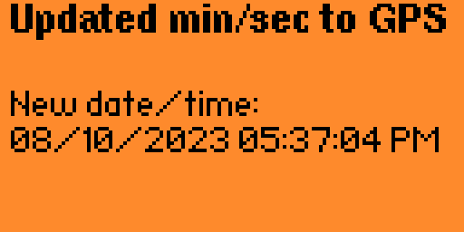

# ublox
Flipper Zero app to read from a u-blox GPS over I2C. This app can
display data, log a path to a KML file, and sync the Flipper's time to
GPS time. Get the app and see more info on the Flipper app hub!

For feature requests or bug reports, open an issue on this repository.

# Usage
This app is compatible with GPSes that follow the UBX protocol version
15, so it is definitely compatible with 8-series GPSes, and probably 9
and 10-series too. I've only tested the app with a u-blox SAM-M8Q
module from SparkFun. 

## Wiring

Connect your GPS to the 3V3, GND, and I2C pins on the Flipper. If you
have a Qwiic GPS and a cable, these are the colors:

| Qwiic color | Flipper pin |
|-------------|-------------|
| Red         | 3V3         |
| Black       | GND         |
| Blue        | C1 (SDA)    |
| Yellow      | C0 (SCL)    |

# Features
## Handheld data display
This app offers two forms of data display: handheld and car. The
handheld displays more info:

- `F/S`: Fix type and satellite number. Fix types:
  - `N`: No fix
  - `R`: Dead-reckoning only
  - `2`: 2D fix
  - `3`: 3D fix
  - `G+D`: Dead-reckoning and GNSS combined
  - `TO`: Time-only
- `Od`: Odometer since last reset. The odometer is inside the GPS.
- `L`: Logging (`Y` = enabled, `N` = disabled)
- `Lat`: Latitude in degrees to 4 decimal digits
- `Lon`: Longitude in degrees to 4 decimal digits
- `Alt`: Altitude
- `Head`: Heading of motion. This is calculated in the GPS by
  tracking motion, so if you're not moving, it won't be remotely
  accurate.
- `UTC`: Time in UTC

All fields that can be localized will be converted to imperial or
metric units, depending on what you've set in Flipper's Settings.

## Car data display

The car data display only displays 3 fields, in big numbers. You could
in theory use it while you're driving (but place it on the dashboard
or something, don't let the Flipper become a hazard).

- `Spd (km/s)` or `Spd (mph)`: Current ground speed in whatever units.
- `Heading`: Heading of motion.
- `Odo (mi)` or `Odo (km)`: Odometer distance since last reset.

## Data display config
Press the left button on the data display to open the configuration
panel.

- `Refresh Rate`: How often the data display should be updated
- `Display Mode`: Handheld or car
- `Notify`: If on, blink the LED on data display updates
- `Platform Model`: Model used by the GPS's "Navigation
  Engine". "Portable" is fine for most applications, but the other
  modes are there if you want them.
- `Odo Mode`: Another input to the Navigation Engine, used to tune the
  odometer calculation.
- `Reset Odometer`: Reset the on-GPS odometer.

## Logging
Press the right button on the data display to start logging. You'll be
prompted to input a filename, and then logging will start. The app
logs to KML format, and you can view them with a tool like [this
one](https://www.doogal.co.uk/KmlViewer). Press the right button to
stop logging. Logging will also stop if you leave the data display.

## Time synchronization

This will synchronize the Flipper's time to the GPS's time. This
doesn't touch the hour, so that your timezone is preserved, but syncs
the minute and second. The Flipper's clock will be up to one second
off, because there's no pulse-per-second signal.

