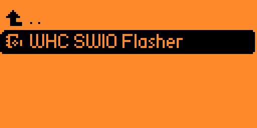
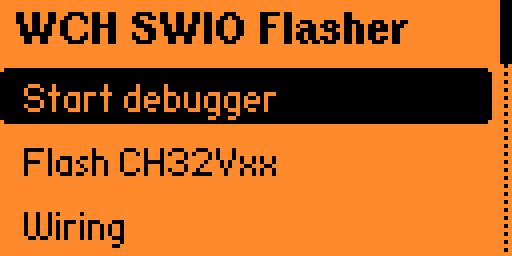
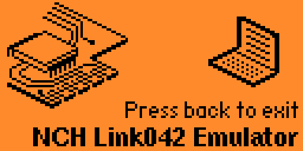
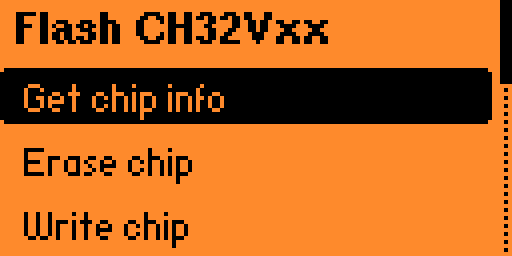

# Flipper Zero WCH SWIO Flasher and debugger

WCH SWIO debugger and flasher emulated on Flipper Zero tool - tool for flashing and debugging CH32V003 chip.


## Features

- [minichlink](https://github.com/cnlohr/ch32v003fun/tree/master/minichlink) compatible flasher/debugger
    - emulated NCH Link042 via bulk USB device (vid = 0x1986, pid = 0x0034)
    - **WARNING:** there is a bug when minichlink uses this emulated NCH Link042 and not properly close bulk transfer. In that case, data on incoming bulk endpoint is buffered in USB driver and not readed by minichlink application before exit. Next minichlink session will fail. Solution is reset USB communication (unplug/plug USB or exit/enter emulator in Flipper app), or patch minichlink app (see chapter Usage/Examples).
- Erase and write program code to ch32v003fun 
    - *still in progress*


## Documentation

### Components

#### SWIO bit bang emulation

Main SWIO magic. Mostly written in ARM Assembler, not relay nice code and definitely is not portable to other platform without huge rework.

See: [RISC-V QingKeV2 Microprocessor Debug Manual](https://github.com/openwch/ch32v003/blob/main/RISC-V%20QingKeV2%20Microprocessor%20Debug%20Manual.pdf) and
[RISC-V Debug Specification](https://github.com/riscv/riscv-debug-spec/blob/master/riscv-debug-stable.pdf)

    - src/helpers/swio.c
    - src/helpers/swio_pin_magic.c

#### WCH flasher & debugger

> code based on [aappleby/PicoRVD](https://github.com/aappleby/PicoRVD)

Planned for future for '*Erase and write program code*' feature, but it has no any usage in this project now.

    - src/helpers/wch_flasher.c
    - src/helpers/riscv_debug.c

#### CH32V003 (RiscV) programs

Utility programs used to run in target RiscV chip. Mostly originated from [aappleby/PicoRVD](https://github.com/aappleby/PicoRVD).

- src/helpers/programs/*

#### Minichlink and NCH Link042 emulator

Code responsible for emulation USB bulk communication with [minichlink](https://github.com/cnlohr/ch32v003fun/tree/master/minichlink).

    - src/nhc_link042_emulator.c
    - src/minichlink_debugger.c


## Usage/Examples

Read chip info
```bash
user@awesomemachine minichlink % ./minichlink -i
Found NHC-Link042 Programmer
Interface Setup
USER/RDPR  : e817/5aa5
DATA1/DATA0: ff00/ff00
WRPR1/WRPR0: 00ff/00ff
WRPR3/WRPR2: 00ff/00ff
Flash Size: 16 kB
R32_ESIG_UNIID1: xxxxxxxx
R32_ESIG_UNIID2: xxxxxxxx
R32_ESIG_UNIID3: ffffffff
```

Erase chip
```bash
user@awesomemachine minichlink % ./minichlink -E
Found NHC-Link042 Programmer
Interface Setup
Whole-chip erase
```

minichlink patch (file `minichlink/nhc-link042.c`, function `TryInit_NHCLink042`)
```c
// After line:
    libusb_claim_interface(hdev, 0);

// Paste this:
    int readed;
    do{
        status = libusb_bulk_transfer(hdev, 0x81, buff, 64, &readed, 10);
    } while(readed > 0 && status == 0);

```
## Screenshots

### Applications / Utils



### WCH SWIO Flasher main menu



### NCH Link042 emulator



### WCH SWIO Flasher screen 
*(work in progress)*



### Wiring


## Acknowledgements

 - [aappleby/PicoRVD](https://github.com/aappleby/PicoRVD)
 - [cnlohr/ch32v003fun](https://github.com/cnlohr/ch32v003fun)
 - [A Visual Guide to Flipper Zero GUI Modules](https://brodan.biz/blog/a-visual-guide-to-flipper-zero-gui-components/)


## License

[MIT](https://choosealicense.com/licenses/mit/)

